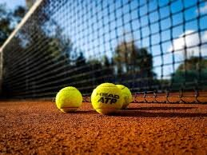
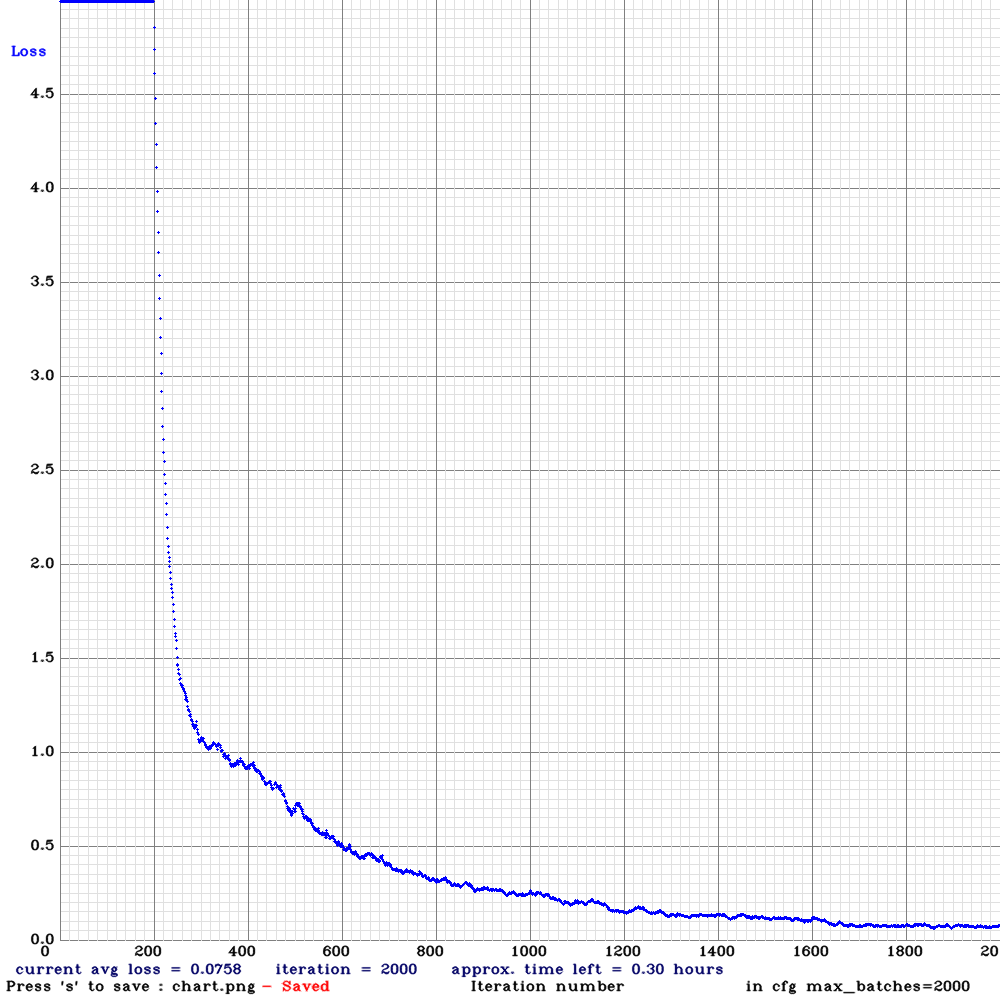
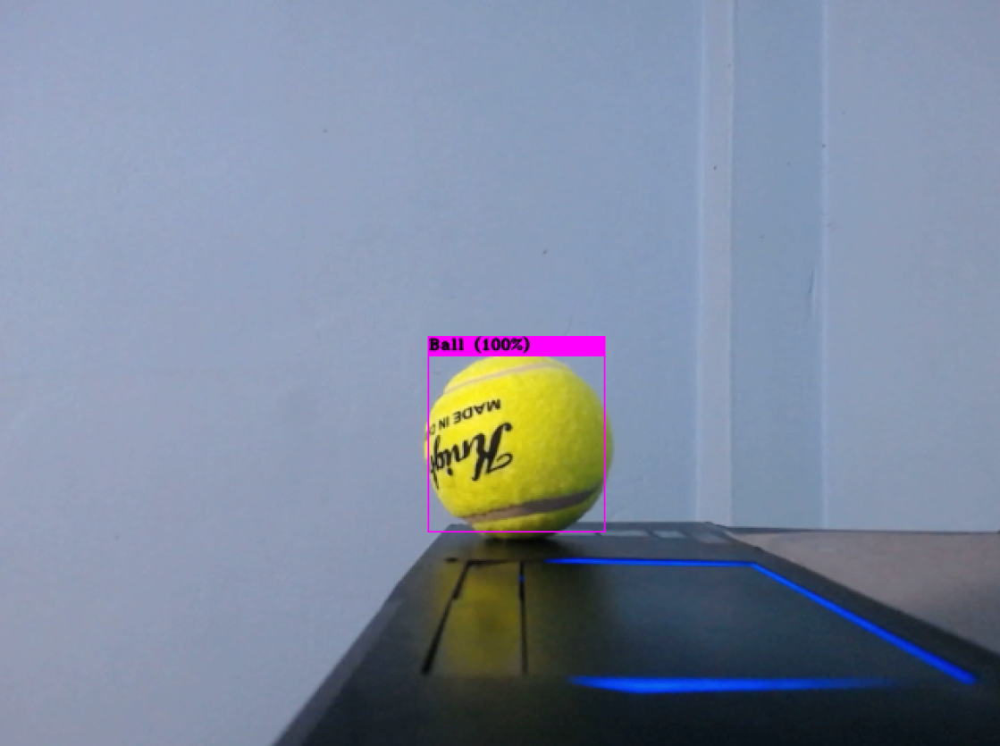

# URC-Tennis-Ball-Detection
This repository contains ball detection classifier using darknet YOLO v3 model for URC 2019 competition.
## No of Classes:
No. of Classes: 1 <br>
Name of the Class: Ball
## Ball Localization Point:
<p align="center">
    
</p>

## Darknet Installation:
You need to install darknet on your Ubuntu 18.04 machine. Follow the tutorial [here](https://github.com/AlexeyAB/darknet) to install darknet in order to use YOLO V3/v4. Check the installation with your webcam to reassure that you have installed it properly.  
## Training Data:
Training & Validation Dataset (i.e `train_ball` & `valid_ball` folder) with proper labeling should be kept inside `~/darknet/data` directory. You can download the training and validation dataset from [here](https://drive.google.com/drive/folders/1bxhhcN0E0jB5janJd5exdtx3wqXDr7tx?usp=sharing). Download pre-trained weight file for convolutional layer from [darknet53.conv.74](https://pjreddie.com/media/files/darknet53.conv.74) & keep it inside `~/darknet` directory. 
## Labelling Data:
In order to label data collected from different sources, install `labelImg`. You can find the corresponding download & installation proccedure [here](https://github.com/tzutalin/labelImg). Just remember when using 'labelImg', change the image labeling format from pascal to YOLO (by clicking on the side button 'pascal') and save the corresponding 'img.txt' labeled files accordingly. Each labeled image will produce a 'x.txt' file where the value 'x' will be the name of the original image. 
## Training Demo:
```
cd ~/darknet
./build-release/darknet detector train data/train_ball.data cfg/yolov3_train_ball.cfg darknet53.conv.74
```
## Training Loss Curve:
<p align="center">
    
</p>

## Generate Weight File:
The default weight file will be saved after every 1000 iterations inside `~/darknet/backup` directory during training. You can use your own weight file or you can use mine. In my case, I have trained for around 2000 iterations. It took around 6 hours for training purpose. You can download the weight file from [here](https://drive.google.com/drive/folders/1bxhhcN0E0jB5janJd5exdtx3wqXDr7tx?usp=sharing).  
## Testing Demo:
```
cd ~/darknet
./build-release/darknet detector demo data/train.data cfg/yolov3_test_ball.cfg backup/yolov3_train_ball_2000.weights -c 0
```
## Testing Result:
<p align="center">
    
</p>

## Resources Used During Training & Testing:
The data were trained inside Ubuntu 18.04 with Nvidia Graphics GTX 1070, Driver version 440.82 & CUDA version 10.2. I took around 300 images for one class of which 270 (90%) images were used as training dataset & 30 images (10%) were used as validation dataset. The testing was done with a logitech webcam and the detection frame rate was 15 fps.  

## Real life Implementation:
<p align="center">
    
</p>

## Image Copyright: 
96% images used in this work during training are taken from mobile phone & other 4% used are taken from internet. Respective people can claim copyright for those images.     
